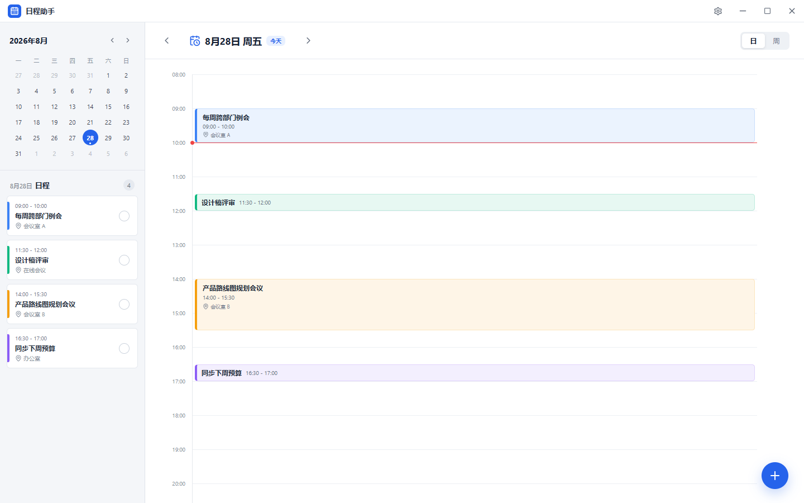
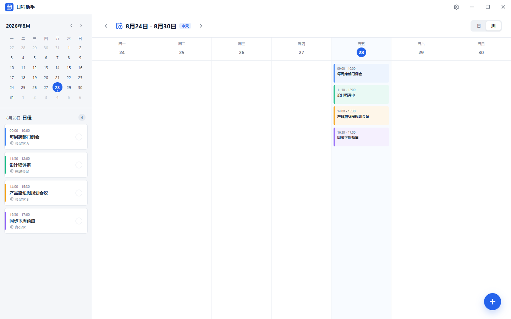
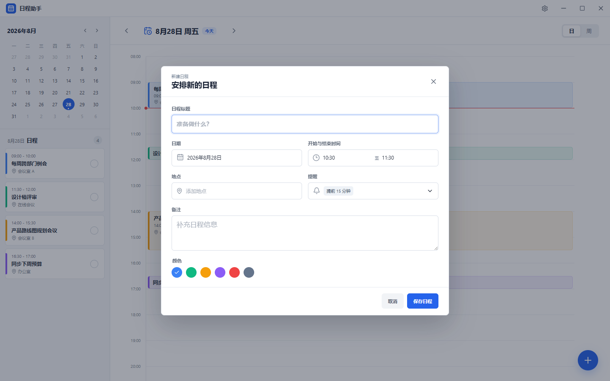

# 日程助手

日程助手是一款本地优先的桌面日程待办提醒软件。项目使用 Wails 3 组合 Go 后端与 React 前端，日程数据保存在本机 SQLite 数据库中，并通过系统通知发送提醒。

## 界面预览

### 日视图

日视图按 08:00 至 21:00 的时间轴展示当天日程，左侧议程列表可快速查看和切换完成状态。



### 周视图

周视图集中展示一周安排，并显示每项日程完整的开始与结束时间。



### 新建日程

日期、时间范围、地点和多提醒在同一个表单中完成；时间选择范围与日历时间轴保持一致。



截图由浏览器开发预览生成；Wails 桌面版复用同一套 React 界面，并额外提供系统通知、托盘和开机启动能力。

## 已实现功能

- 日视图与周视图，以及迷你月历导航
- 新建、编辑、删除日程和完成状态切换
- 日期时间选择、地点、备注、颜色和多提醒配置
- SQLite 本地持久化与重复提醒去重
- 系统通知、通知点击回到日程、系统唤醒后补充扫描
- 单实例、关闭到系统托盘、托盘快捷新建
- 可选开机后台启动
- 面向 Codex、Claude Code 和脚本自动化的 JSON CLI
- 浏览器开发预览使用 `localStorage` 降级，无需启动桌面壳即可调试页面

## 技术架构

| 层级 | 技术 | 职责 |
| --- | --- | --- |
| 桌面容器 | Wails 3 Beta | 窗口、托盘、通知、开机启动、打包 |
| 后端 | Go 1.25 | 业务校验、提醒调度、前端绑定服务 |
| 数据 | SQLite（modernc 纯 Go 驱动） | 日程与提醒发送记录持久化 |
| AI 接口 | `scheduleassistant.exe schedule ...` | 通过稳定 JSON 契约创建和查询日程 |
| 前端 | React 18、TypeScript、Vite | 日历、日程表单和设置界面 |
| 测试 | Go test、Vitest、Playwright | 领域、仓储、前端组件和完整业务 UAT |

## 项目结构

```text
.
├─ main.go                     # GUI/CLI 进程入口与 Wails 组装
├─ schedule_service.go         # 暴露给前端的 Wails 适配层
├─ internal/                   # CLI、领域模型、提醒调度和数据仓储
├─ frontend/                   # React 前端、绑定、单测和浏览器 UAT
├─ build/                      # Wails 各平台构建与打包配置
├─ docs/prototypes/            # 初始界面原型图
├─ skills/schedule-assistant/  # 可分发的 Codex Skill
└─ scripts/                    # 项目安装和维护脚本
```

根目录的 Go 文件只负责可执行程序组装和 Wails 桥接；可独立测试的业务逻辑均位于 `internal`。这是兼容 Wails 根包构建方式的有意安排，不是将后端实现平铺在根目录。

## 本地开发

环境要求：Go 1.25、Node.js 22、Wails 3 Beta.15。Windows 还需要 WebView2 Runtime。

```powershell
cd frontend
npm install
npm run dev
```

浏览器预览地址为 `http://127.0.0.1:9245/`。运行完整桌面开发环境：

```powershell
wails3 dev
```

需要更新 README 截图时，先启动浏览器预览，再在另一个终端执行：

```powershell
cd frontend
npm run screenshots:readme
```

## 测试与构建

```powershell
go test ./...
cd frontend
npm test
npm run build
cd ..
wails3 build
```

Windows 生产可执行文件生成在 `bin/scheduleassistant.exe`。安装包需要安装 NSIS 后执行：

```powershell
wails3 package
```

同一个 `scheduleassistant.exe` 同时提供 GUI 和 CLI：无参数启动桌面界面，带 `schedule` 命令时不创建窗口并直接返回 JSON。AI 或自动化脚本可以写入桌面版使用的同一个 SQLite 数据库：

```powershell
bin\scheduleassistant.exe schedule create `
  --title "设计评审" `
  --date 2026-08-30 `
  --start 09:00 `
  --end 10:00 `
  --reminders 15,30

bin\scheduleassistant.exe schedule list --date 2026-08-30
```

CLI 默认输出适合 AI 解析的 JSON，完整参数、错误契约和 Skill/MCP 接入方式见 [AI 集成指南](./docs/AI_CLI.md)。

仓库内已提供 Codex Skill。本地克隆后可执行：

```powershell
powershell -ExecutionPolicy Bypass -File .\scripts\install-codex-skill.ps1
```

仓库公开发布后，未克隆仓库的用户可以先下载并检查安装脚本，再执行：

```powershell
$skillInstaller = Join-Path $env:TEMP 'install-schedule-assistant-skill.ps1'
Invoke-WebRequest 'https://raw.githubusercontent.com/lusy37/schedule-assistant/main/scripts/install-codex-skill.ps1' -OutFile $skillInstaller
powershell -ExecutionPolicy Bypass -File $skillInstaller
Remove-Item -LiteralPath $skillInstaller
```

该脚本只安装 `SKILL.md` 和 Codex 界面元数据，不下载第二个 EXE。Skill 仍调用桌面版自带的同一个 `scheduleassistant.exe`。

## 数据位置

桌面版数据库位于当前用户配置目录的 `ScheduleAssistant/schedule-assistant.db`。数据库启用 WAL、外键约束和忙等待，提醒发送记录用于避免同一提醒重复通知。

项目范围与后续迭代计划见 [实施计划](./docs/IMPLEMENTATION_PLAN.md)，初始界面原型归档在 [docs/prototypes](./docs/prototypes)。
